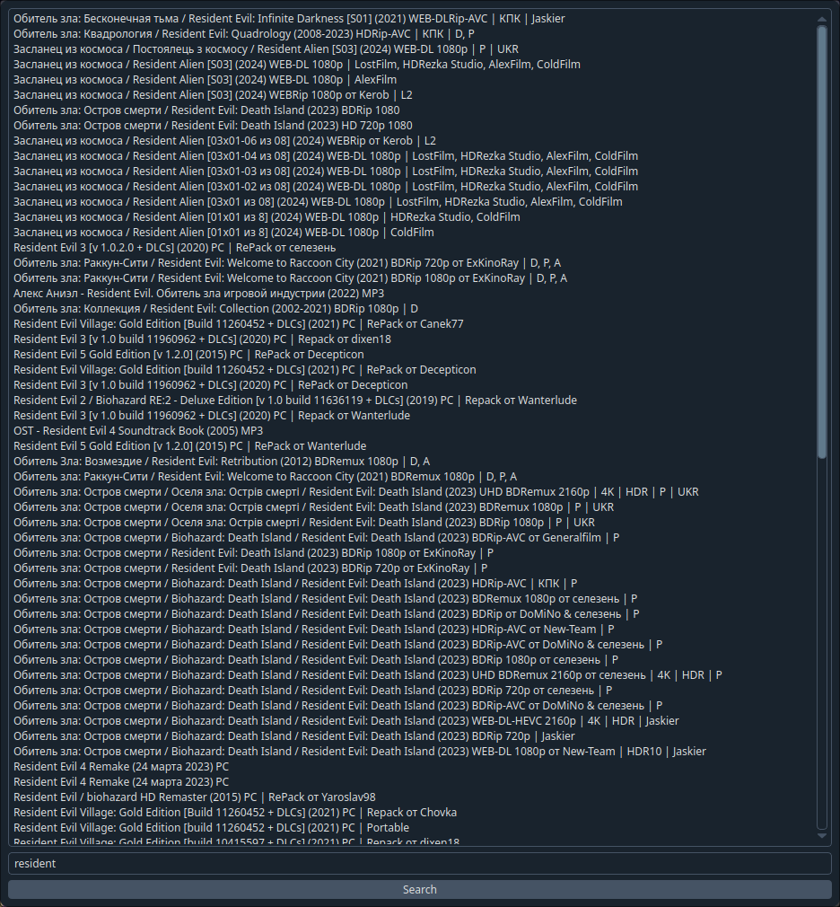

# Rutor Parser

Простой скрипт для просмотра торрентов на руторе.


Есть возможность поиска и открытия торрентов в браузере.

## Установка

Клонируйте репозиторий:
```git clone https://github.com/ballkicker228/RutorParser```
Перейдите в папку:
```cd RutorParser```
Установите зависимости:
```./install.sh```
Теперь можно запускать скрипт:
```./start.sh```

## TODO

- ~~Добавить gui~~
- Сделать поиск по категориям
- Искать по всем страницам результатов
- Добавить диалоговое окно для просмотра описания торрента
- Сделать авторизацию по cookie и скачивание торрентов из скрипта
