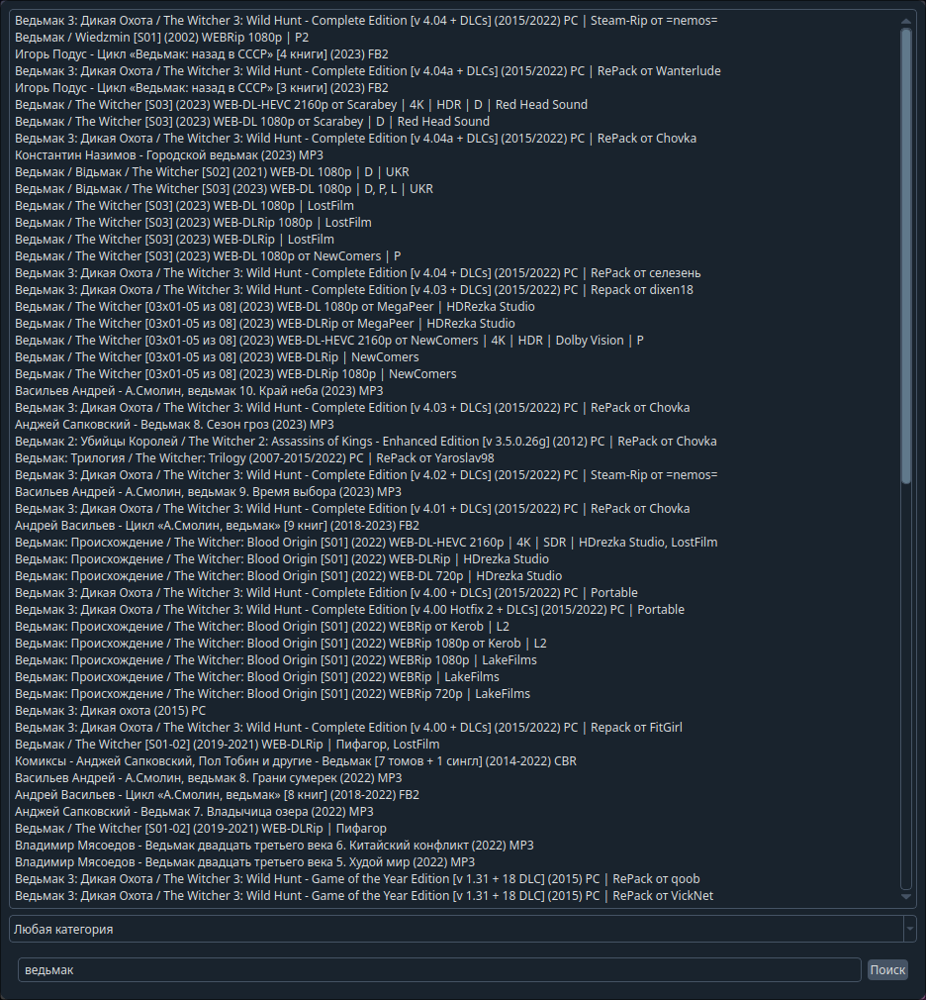

# Rutor Parser

Простой скрипт для просмотра торрентов на руторе.



Есть возможность поиска и открытия торрентов в браузере.

## Установка(Windows)
Скачайте архив с веб версии и разархивируйте в удобную папку. У вас должен быть установлен python и pip.
```bash
cd RutorParser-master
```
Установите зависимости
```bash
install.bat
```
Запустите скрипт
```bash
start.bat
```

## Установка(Linux)

Клонируйте репозиторий:
```bash
git clone https://github.com/ballkicker228/RutorParser
```
Перейдите в папку:
```bash
cd RutorParser
```
Установите зависимости:
```bash
./install.sh
```
Теперь можно запускать скрипт:
```bash
./start.sh
```

## TODO

- ~~Добавить gui~~
- Сделать поиск по категориям
- Искать по всем страницам результатов
- ~~Добавить диалоговое окно для просмотра описания торрента~~
- Сделать авторизацию по cookie и скачивание торрентов из скрипта
- Убрать блокировку интерфейса при запросах
